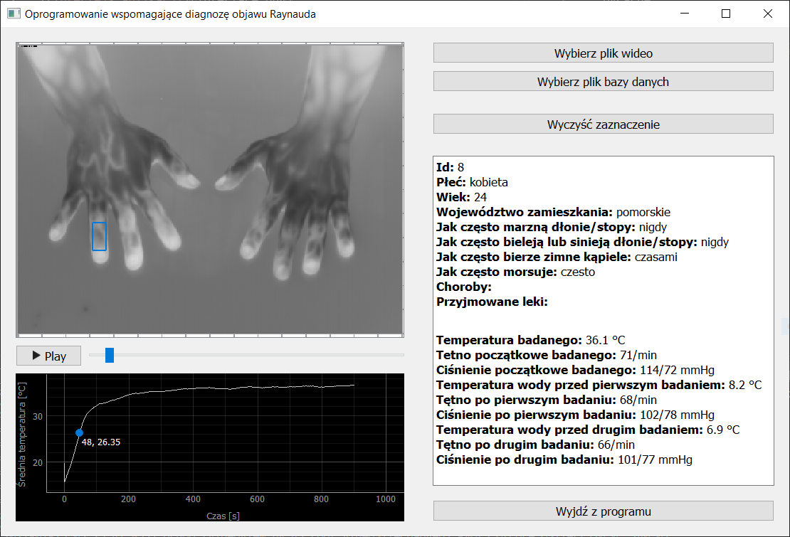

# Objaw Raynauda
## Spis treści
1. [Opis](#opis)
2. [Instalacja zależności](#instalacja-zależności)
3. [Uruchamianie](#uruchamianie)
4. [Tworzenie pliku EXE oraz instalatora](#tworzenie-pliku-exe-oraz-instalatora)

## Opis

Aplikacja wspomagająca diagnozę objawu Raynauda poprzez analizę wykonanych nagrań termowizyjnych, będących wynikiem badania, składającego się z dwóch prowokacji objawu Raynauda za pomocą zanurzania dłoni w zimnej wodzie, a następnie rejestracji procesu ogrzewania się dłoni, przy pomocy kamery termowizyjnej.

Aplikacja umożliwia odtworzenie wykonanych nagrań termowizyjnych oraz wyświetlenie danych z bazy danych, zawierających dane z ankiety wypełnianej przez badanego oraz dane z raportu o badaniu. Aplikacja również umożliwia wykreślenie wykresu zmieniania się średniej temperatury w czasie na dowolnym obszarze nagrania termowizyjnego. 

## Instalacja zależności
Aplikacja tworzona i testowana dla Pythona w wersji 3.8. Brak testów dla innych wersji.

Moduły niezbędne do uruchomienia programu spisane są w pliku [requirements.txt](requirements.txt). Wszystkie moduły poza jednym dostępne są publicznie w repozytorium PyPI. Moduł `FileSDK` należy uprzednio zbudować własnoręcznie [wg poniższej instrukcji](#tworzenie-modułu-filesdk) i wynikowy plik _wheel_ umieścić w podfolderze `lib`.

W celu instalacji modułów należy w linii poleceń wywołać:
```
python -m pip install -r requirements.txt
```

### Tworzenie modułu `FileSDK`
Należy pobrać pakiet _FLIR Science File SDK_ ze [strony firmy FLIR](https://flir.custhelp.com/). W tym celu należy założyć tam konto i na [stronie pobierania](https://flir.custhelp.com/app/account/fl_downloads) wybrać _Software and Firmware_,  kategoria _SDK's (Software Development Kits)_ ➔ _FLIR Science File SDK_ w wersji odpowiedniej dla swojego systemu operacyjnego.

Po zainstalowaniu pobranego oprogramowania należy uruchomić program _Science File SDK_ oraz wybrać opcję _Python - Start here for Python apps_, która otworzy w przeglądarce stronę z instrukcją budowania modułu. W celu zbudowania modułu należy wykonać polecenia z części _Redistribution_, w szczególności należy z poziomu folderu nadrzędnego względem tego, w którym znajduje się otwarta strona HTML, w wierszu poleceń uruchomić polecenie
```
python setup.py bdist_wheel --shadow-dir /folder/tymczasowy
```
Polecenie to w podanym folderze tymczasowym w podfolderze `dist` stworzy plik `FileSDK-*.whl`, który należy przenieść do podfolderu `Aplikacja/lib`.

### Uwagi dla systemu Windows 10
Budowanie modułu `FileSDK` wiąże się z kompilacją kodu w C++, dlatego należy mieć uprzednio zainstalowany odpowiedni kompilator.
Pod systemem Windows 10 należy więc zainstalować _Visual Studio Build Tools_. Po uruchomieniu instalatora, poza składnikami obowiązkowymi, należy wybrać:
* MSVC ... - narzędzia kompilacji środowiska C++
* Windows 10 SDK

## Uruchamianie
Po zainstalowaniu wszystkich zależności, program można uruchomić następująco:
```
python application.py
```

## Tworzenie pliku EXE oraz instalatora
Istnieje możliwość zebrania wszystkich zależności w jednym folderze i stworzenia pliku EXE, który można uruchomić bez konieczności instalowania zależności. Służy do tego narzędzie `cx_Freeze`, które należy najpierw zainstalować:
```
python -m pip install cx_Freeze
```
### Tworzenie pliku EXE z załączonymi zależnościami:
```
python -m pip setup.py build
```
Wynik pojawi się w podfolderze `Aplikacja/build/exe*/ObjawRaynauda.exe`
### Tworzenie pliku instalacyjnego MSI
```
python -m pip setup.py bdist_msi
```
Wynik pojawi się w podfolderze `Aplikacja/dist/ObjawRaynauda-*.msi`